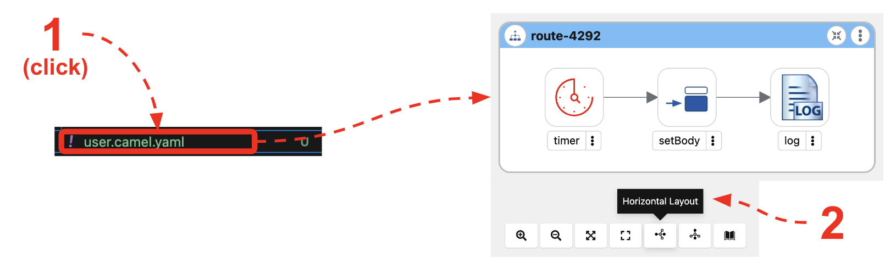
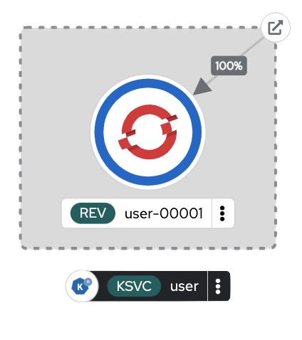
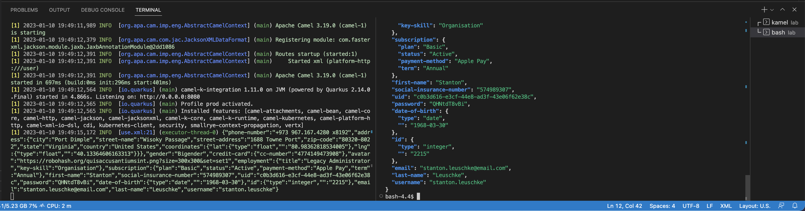
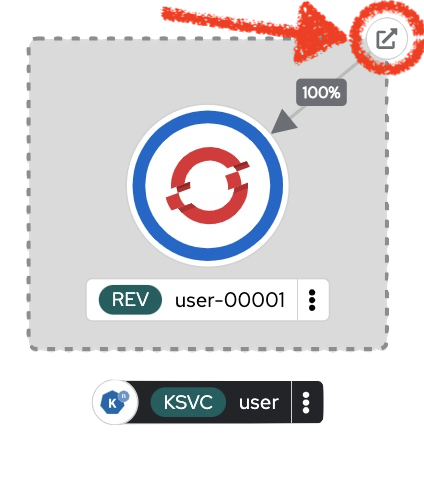

:walkthrough: Lab Introduction
:user-password: openshift
:namespace: {user-username}

:experimental:

:article-url: https://developers.redhat.com/articles/2023/03/09/try-camel-k-developer-sandbox
// URLs
:codeready-url: http://codeready-che.{openshift-app-host}/

ifdef::env-github[]
endif::[]

[id='lab-intro']
= Camel - User Demo

Use Camel's fast prototyping using low-code UI and commands to build your integration flows and deploy them on OpenShift.

// Walk your first steps with Camel K by creating and running your first integration service that integrates with a legacy backend.

This hands-on lab is based on the following blog article in Red Hat Developers:

* link:{article-url}[window="_blank", , id="rhd-source-article"]

{empty} +

The sequence diagram below illustrates the flow you're about to create.

image::images/seq-diagram.png[align="center", width=40%]

{empty} +

The Camel integration will expose an HTTP entry point, and upon client requests, it'll fetch XML data from a (simulated) legacy backend, transform its response into JSON, and return it to the client application.

Assuming you have followed the article's instructions, you should be all set to get hands-on with _Camel_ in the _OpenShift Dev Spaces_ workspace.

{empty} +


[time=1]
[id="introduction"]
== Introduction

If you haven't used _Apache Camel_ before, or haven't played with recent versions and tools, it's important you read below all the pieces that are at play, and understand they are conceived to converge into providing a unified development experience.

To briefly introduce the set of tools you're about to use, here's a list of the components that will help you along the way:

- *Dev Spaces / VSCode*: the IDE you'll be using to create the _Camel_ processes.
- *Apache Camel*: the integration framework you'll use packed with Enterprise Integration Patterns and Components (connectors).
- *Kaoto*: visual editor for _Apache Camel_ to create your _Camel_ routes and processes in VS_Code.
- *Camel JBang*: _Camel_ CLI (command line interface) designed to boost prototyping and accelerate your work to create, test and deploy your applications.
- *Quarkus*: The runtime used by _Camel_ to deploy your integration processes on _OpenShift_
- *OpenShift*: _Kubernetes_ environment where you will deploy your _Camel_ project.

{empty} +

=== No Java

One big highlight of the exercises you're about to embark on is that although _Apache Camel_ is _Java_ based, you won't see a single line of _Java_, nor have to define or manage dependencies. Those concerns are kept hidden to allow the developer become more productive by focussing on the business case at hand.

NOTE: It goes without saying that at any moment in time _Java_ code can be injected within your _Apache Camel_ processes to incorporate the custom handling you need. _Apache Camel_ excels in this respect thanks to its open framework architecture and extensibility.

{empty} +


[time=2]
[id="preparations"]
== Lab Preparations

Before we start real work, let's prepare some equipment before riding the _Camel_.

{empty} +

. Toggle auto-save off
+
You'll be making live code changes which _Camel_ can pick up in real time. You need to ensure the changes do not trigger a reload every time you press a key, but only when you manually save your changes.
+
image::images/autosave.png[align="left", width=30%]
+
WARNING: The auto-save option in the menu does not always show when it's active/inactive. If you see in your editor's file tab a permanent white dot `⭘` when you make changes, it means auto-save is OFF.
+
{empty} +

. Open your terminal
+
Make sure you make visible your terminal in the IDE. You can toggle it using the keyboard keys kbd:[Ctrl + `] or simply find the option from the menu system as per the picture below:
+
image::images/toggle-terminal.png[align="left", width=40%]

. Create a working folder
+
Execute the commands below to create a new directory from where you can work and is visible in your project explorer:
+
[source, subs=]
----
mkdir lab
cd lab
<br>
----
+
{empty} +

. Set your working project in _OpenShift_
+
Make sure your CLI `oc` client (_OpenShift_ client) points to your personal _Developer Sandbox_ project (aka namespace):
+
[source, subs=]
----
oc project $WORKSPACE_NAMESPACE<br>
----
+
NOTE: The _Developer Sandbox_ only allows 1 project (namespace) per user.
+
The command above should output something similar to:
+
----
Already on project "<your-username>--dev" on server "https://172.30.0.1:443".
----
+
{blank}
+
WARNING: Not specifying your target project (namespace) in _OpenShift_ may result in a deployment failure.
+
{empty} +


You're now all set and ready start riding the _Camel_.

{empty} +


[time=8]
[id="development"]
== Fast Prototyping

This section shows you to prototype your project in fast iteration cycles. _Camel JBang's_ provides a *'developer mode'* that allows it to detect and apply on-the-fly any changes you perform.

To make the example interesting, the service you will create will operate as an adaptation layer, collecting data in XML format from a remote server and transforming it to JSON. This is a very typical use case where modern API façades serve data obtained from legacy systems.

{empty} +

. Create your integration definition
+
To swiftly create a skeleton _Camel_ route definition, we can use the `camel` client ( link:https://camel.apache.org/manual/camel-jbang.html[_Camel JBang_, window="_blank", id="camel-jbang"] client) from the terminal. Execute the following command:
+
[source, subs=]
----
camel init user.camel.yaml<br>
----
+
{blank}
+
The above command initialises a YAML-based _Camel_ definition. Other languages, like Java and XML, are also supported.
+
{empty} +

. Open the route in the visual editor
+
You'll find your newly created integration file under the following path in your project explorer:
+
--
* `lab/user.camel.yaml`
+
{empty}
+
image::images/camel-route-users.png[align="left", width=30%]
+
NOTE: Ignore other _Camel_ resources (folders) in the project tree,  they belong to other lab tutorials included in the same _GitHub_ repository.
--
+
{blank}
+
Click on the _Camel_ source file to display it in _Kaoto_ (_Camel_'s visual editor).
+

+
The visual editor will show you the default _Camel_ route initialised in step 1, consisting in a timer-to-log processing flow that generates an event every second. Each execution defines a payload (body) and writes it to log.
+
{empty} +


. Run the integration in *'developer mode'*:
+
[source, subs=]
----
camel run * --dev<br>
----
+
NOTE: the `*` indicates to load all source files in the folder. the `--dev` flag activates the developer mode.
+
{blank}
+
After Camel finishes the start up phase, you'll see a new trace every second, similar to:
+
----
2024-10-24 07:21:27.941  INFO ... : Hello Camel from route1
2024-10-24 07:21:28.941  INFO ... : Hello Camel from route1
2024-10-24 07:21:29.941  INFO ... : Hello Camel from route1
----
+
{empty} +


. Start making changes in the _Camel_ route. 
+
Because you're running _Camel_ in developer mode, every change you do in the editor will trigger a hot-reload and automatic restart.
+
Update the `timer` definition. +
Look at the figure below and follow these steps:
+
--
. Click the timer activity to open the configuration pane.
. Click kbd:[All] (properties).
. Use the filter `repeat` to search and find properties.
. Set the `repeatCount` property to 1.
. Close the configuration pane.
--
+
image::images/kaoto-timer-update.png[align="left", width=50%]
+
{blank}
+
In the logs, you will see Camel react by restarting and executing the route only once, because `repeatCount` was set to 1:
+
----
2024-10-24 10:22:23.443  INFO ... : Routes reloaded summary (total:1 started:1)
2024-10-24 10:22:23.443  INFO ... :     Started route-4178 (timer://yaml) (source: user.camel.yaml:4)
2024-10-24 10:22:24.442  INFO ... : Hello Camel from route-4178
----
+
{empty} +

. Define an HTTPS call
+
.. Copy the endpoint URL below:
+
[source, subs=]
----
https://random-data-api.com/api/v2/users?response_type=xml
----
+
NOTE: The parameter `response_type` tells the server to return the data in XML format.
+
.. Look at the figure below and follow these steps:
+
--
. Click the 3 dots kbd:[*⋮*] in `setBody`.
. Click kbd:[Replace].
. Use the filter `https` to search and find the component.
. Select the HTTPS component.
. Click on the HTTPS step.
. Paste the URL (you copied above) in the `Http Uri` property.
. Close the configuration pane.
--
+
image::images/kaoto-https.png[align="left", width=100%]
+
{blank}
+
In the logs, you will see _Camel_ reacting and fetching an XML response from the backend, similar to the sample lot traces below:
+
----
Routes reloaded summary (total:1 started:1)
    Started route-4178 (timer://yaml) (source: user.camel.yaml:4)
<?xml version="1.0" encoding="UTF-8"?>
<hash>
  ...
  <username>jackqueline.mosciski</username>
  <email>jackqueline.mosciski@email.com</email>
  ...
----
+
{empty} +

. Define an HTTP listener
+
Now, expose the process as a service. Replace the Timer event producer with an HTTP listener.
+
Look at the figure below and follow these steps:
+
--
. Click the 3 dots kbd:[*⋮*] in `timer`.
. Click kbd:[Replace].
. Use the filter `platform-http` to search and find the component.
. Select the *Platform HTTP* card.
. Click on the `platform-http` step.
. Set the Path property with `/user`.
. Close the configuration pane.
--
+
image::images/kaoto-platform-http.png[align="left", width=100%]
+
{blank}
+
In the logs, you will see _Camel_ reacting and fetching an XML response from the backend, similar to the sample lot traces below:
+
----
Routes reloaded summary (total:1 started:1)
    Started route-4178 (timer://yaml) (source: user.camel.yaml:4)
<?xml version="1.0" encoding="UTF-8"?>
<hash>
  ...
  <username>jackqueline.mosciski</username>
  <email>jackqueline.mosciski@email.com</email>
  ...
----
+
{empty} +

. Clean incoming HTTP headers
+
To ensure the process cleanly calls the HTTP endpoint and to prevent header propagation, you need to include a step to clean the incoming HTTP headers.
+
Look at the figure below and follow these steps:
+
--
. Click the 3 dots kbd:[*⋮*] in `platform-http`.
. Click kbd:[+ Add step].
. Use the filter `removeheaders` to search and find the component.
. Select the *Remove Headers* card.
. Click on the `removeHeaders` step.
. Set the Pattern property to `*`.
. Close the configuration pane.
--
+
image::images/kaoto-remove-headers.png[align="left", width=100%]
+
{blank}
+
At this point your Camel route should look in Kaoto as the picture below:
+
image::images/kaoto-flow-phase-1.png[align="left", width=50%]
+
{blank}
+
In the logs, you should see _Camel_ having reacted from the updates above and showing the following traces:
+
----
... : Routes reloaded summary (total:1 started:1)
... :     Started route-4178 (platform-http:///user) (source: user.camel.yaml:5)
----
+
{empty} +

. Test the listener
+
To validate what you've done so far, test the listener from a new terminal. Choose the _Split_ option from the current terminal's top right corner, as shown below:
+
image::images/terminal-split.png[align="left", width=30%]
+
{blank}
+
From the new terminal, run the following cURL command to test your service:
+
[source, subs=]
----
curl -s http://localhost:8080/user | bat -pP -lxml<br>
----
+
NOTE: The command also includes a pipe to colorize the XML output for better reading.
+
The invocation should return an XML header similar to:
+
----
<?xml version="1.0" encoding="UTF-8"?>
<hash>
  <id type="integer">8077</id>
  <uid>1d2f4251-deec-4208-a21a-166cf631c061</uid>
  <password>9lJ6UGqIZE</password>
  ...
----
+
{blank}
+
So far so good.
+
{empty} +

. Apply XML to JSON transformation
+
Keep iterating the prototype by introducing XML to JSON translation.
+
In _Camel_ there are many strategies available to convert XML into JSON. In this case you will use the _Marshal/Unmarshal_ EIP to update the flow. You do it by adding two extra steps to the process: first _Unmarshal_ (XML) and then _Marshal_ (JSON).
+
====
.. Start by unmarshalling the XML data +
+
Look at the figure below and follow these steps:
+
--
. Right-click on the `https` step.
. Select the  kbd:[Append] option.
. Use the filter `unmarshal` to search and find the component.
. Select the *Unmarshal* card.
. Click on the `unmarshal` step.
. Select the *Jackson XML* Data Format.
. Close the configuration pane.
--
+
image::images/kaoto-unmarshal-xml.png[align="left", width=100%]
+
.. Then marshal to JSON
+
Look at the figure below and follow these steps:
+
--
. Right-click on the `unmarshal` step.
. Select the  kbd:[Append] option.
. Use the filter `marshal` to search and find the component.
. Select the *Marshal* card.
. Click on the `unmarshal` step.
. Select the *Json* Data Format.
. Close the configuration pane.
--
+
image::images/kaoto-marshal-json.png[align="left", width=100%]
+
{blank}
====
+
At this point your Camel route should look in Kaoto as the picture below:
+
image::images/kaoto-flow-phase-2.png[align="left", width=50%]
+
{blank}
+
In the logs, you should see _Camel_ having reacted from the updates above and showing the following traces:
+
----
... : Routes reloaded summary (total:1 started:1)
... :     Started route-4178 (platform-http:///user) (source: user.camel.yaml:5)
----
+
{empty} +

. Test the XML to JSON transformation
+
Test the Unmarshal/Marshal steps with the command below:
+
[source, subs=]
----
curl -s http://localhost:8080/user | jq<br>
----
+
NOTE: The command also includes a pipe to colorize the JSON output for better reading.
+
The invocation should return JSON data, similar to:
+
----
{
  "phone-number": "+63 890.053.3511 x6876",
  "address": {
    "city": "Feestport",
    "street-name": "Cecil Camp",
    "street-address": "12806 Abbott Summit",
  ...
----
+
{blank}
+
You're on track.
+
{empty} +

. dgsfg
+
From the code below, take the snippet with the image:images/copypaste.png[width=5%] (copy) button and inject it in your code in the same region as shown below, right after the outgoing HTTP invocation:
+
----
    <route id="xml">
        <from uri="timer:xml?repeatCount=1"/>

        <removeHeaders pattern="*"/>
        <to uri="https://random-data-api.com/api/v2/users?response_type=xml"/>
----
+
```xml
        <unmarshal>
            <jacksonXml/>
        </unmarshal>
        <marshal>
            <json/>
        </marshal>
```
+
----
        <log message="${body}"/>
    </route>
----
+
{blank}
+
NOTE: the marshal/unmarshal directive in _Camel_ converts data via the use of _Camel_ data formats. These are automatic data format converters. In the code above, the XML response is unmarshalled into a mid-step _Java_ structure, and then marshalled into the final JSON data.
+
Press kbd:[ctrl+s] (linux) or kbd:[⌘+s] (mac) to save your changes.
+
The _Camel JBang_ client, running in *'dev mode'*, catches the changes and pushes the new definition to _OpenShift_, causing the _Camel K_ operator to react and trigger a fast build/deploy replacing the previous version. From the developer's perspective, this happens transparently and very fast.
+
You will see in the terminal _Camel_ reloading the new definition and triggering a new HTTP request and this time displaying the result in JSON format, similar to:
+
----
{  … ,"email": "edith.green@email.com", …,"username": "edith.green"}
----
+
NOTE: The sample above is trimmed to just show some of the relevant fields. Your response will contain many other fields.
+
{empty} +
+
1. Expose the integration as an HTTP service
+
Since the payload is now transformed in the desired output format, we can perform one last edit to expose the service to be consumable via an HTTP entry point.
+
Replace the starting `timer` activity with the `platform-http` component. From the code below, take the snippet with the image:images/copypaste.png[width=5%] (copy) button and replace the current `timer` activity in your code in the same region as shown below, right at the start the _Camel_ route:
+
----
    <route id="xml">
----
+
```xml
        <from uri="platform-http:/user"/> 
```
+
----
        <removeHeaders pattern="*"/>
        <to uri="https://random-data-api.com/api/v2/users?response_type=xml"/>
        <unmarshal>
            <jacksonXml/>
        </unmarshal>
        <marshal>
            <json/>
        </marshal>
        <log message="${body}"/>
    </route>
----
+
{blank}
+
The new `platform-http` activity above tells _Camel_ to use the native HTTP library to accept incoming invocations using the `/user` path.
+ 
Press kbd:[ctrl+s] (linux) or kbd:[⌘+s] (mac) to save your changes.
+
Once more, the platform's operator reacts and deploys a new version of the definition, except this time, we can invoke the service from a terminal to test it.
+
NOTE: When _Camel K_ defines an HTTP entrypoint it automatically deploys it as a _Knative_ serverless application by default. You will see the pod scale to zero when no traffic comes in. When a request comes in, _Knative_ scales up the pod and the application consumes it and responds.
+
{blank}
+
If you have a look to your topology view from your OpenShift developer console, you'll see the integration running as serverless app (can scale to zero), as per the picture below:
+

+
{empty} +
+
1. Test the service
+
Now, test the service from a new terminal. Choose the _Split_ option from the current terminal's top right corner, as shown below:
+
image::images/terminal-split.png[align="left", width=40%]
+
{blank}
+
From the new terminal, run the following cURL command to test your service:
+
[source, subs=]
----
curl `kn route list -o jsonpath={.items[?(@.metadata.name==\"user\")].status.url}`/user | jq<br>
----
+
NOTE: The curl command resolves the URL by using the _Knative_ client `kn` and extracting the http route of the service.
+
NOTE: The command includes a pipe to parse the JSON response with JQuery, which nicely renders the returned JSON payload.
+
{blank}
+
You should see `curl` returning new randomly generated user data, in the expected JSON format.
+
NOTE: If the pod was scaled to zero, the curl command will trigger it to scale to 1 and process the request.
+
{blank}
+
You should see in your IDE a view similar to the picture below showing both terminals, the logs from the _Camel K_ integration running in the _Developer Sandbox_, and the `curl` command output:
+


{empty} +

[type=verification]
Did you obtain the a JSON response similar to the one shown above?

[type=verificationSuccess]
You've successfully tested your Camel K HTTP service !!

[type=verificationFail]
Inspect the logs to investigate possible causes of failure.

{empty} +

Consider the development phase done. +
Press kbd:[ctrl+c] to stop your Camel K instance.

When stopped, you'll notice the pod in your _Developer Sandbox_ disappear:

image::images/pod-user-deleted.png[align="left", width=60%]

{empty} +

[type=verification]
Did you see your `user` pod deleted?

[type=verificationSuccess]
You're ready to step to the next chapter !!

[type=verificationFail]
You can try running `oc delete integration user` to force deleting the pod.


[time=4]
[id="deploy-integration"]
== Deploy your integration


Running the `kamel` client with the `--dev` flag (dev mode) showed you in the previous chapter how to hook your terminal with the running pod  (dev mode) in the _Developer Sandbox_. Now you will deploy your integration detached from your IDE.

. Execute the deployment command
+
All it takes to deploy your integration is to remove the `--dev` flag. +
Copy and paste the command below to push the integration to the _Developer Sandbox_:
+
[source, subs=]
----
kamel run user.xml \
-d camel-jackson \
-d camel-jacksonxml<br>
----
+
{blank}
+
What really happens behind the scenes when executing the command above is that the `kamel` client converts your source code into an _Integration_ CRD (Custom Resource Definition) defined in YAML and then pushes it to the _Developer Sandbox_.
+
It is the _Camel K_ operator, not visible to you, running in the _Developer Sandbox_, that picks up the CRD and triggers a build and deploys it.
+
{empty} +

. Visualise your pod
+
If you switch to your _Developer Sandbox_ topology view, you'll see the pod running again, only this time is not hooked to your terminal:
+

+
{empty} +

. Use the CLIs to confirm
+
You can use your terminal to obtain information about your running integration.
+
Using your `kamel` client, execute:
+
[source, subs=]
----
kamel get<br>
----
+
{blank}
+
Which should return something similar to:
+
----
NAME    PHASE   KIT
user    Running camel-k-operator/kit-ceu0v85mq41b5tocq4sg
----
+
{empty} +
+
Using your `oc` client (_OpenShift_ client), execute:
+
[source, subs=]
----
oc get integration<br>
----
+
{blank}
+
Which should return something similar to:
+
----
NAME   PHASE     KIT                        REPLICAS
user   Running   kit-ceu0v85mq41b5tocq4sg   1
----
+
{empty} +

. Invoke the service as an external client
+
You can notice, from your topology view, your pod showing a small icon to open the URL exposed by the service:
+

+
Click on it.
+
If your browser renders “Resource not found” or another error message, make sure your address bar uses HTTP (not HTTPS), and you include the service path ‘/user’ at the end of the URL, something similar to:
+
--
* `**http://**…(long address value here)...**/user**`
--
+
{blank}
+
In your browser, you should see user data in JSON format, similar to:
+
image::images/user-http-response.png[align="center", width=100%]
+
You can also obtain the route details with the following command and use its URL from your favourite local HTTP client/tester, like _Postman_, _Swagger_ or others.
+
[source, subs=]
----
kn route list -o jsonpath={.items[?(@.metadata.name==\"user\")].status.url}<br>
----
+
{blank}
+
Embedding the `kn` command in a cURL allows you to invoke the service as an external consumer.
+
--
* Copy/paste the following cURL command to simulate an external call and obtain a response from the _Camel_ service:
+
[source, subs=]
----
curl `kn route list -o jsonpath={.items[?(@.metadata.name==\"user\")].status.url}`/user | jq<br>
----
+
{blank}
+
The invocation should return the expected JSON payload.
+
--


{empty} +

[type=verification]
Did you see succeed to invoke the `user` service as an external consumer?

[type=verificationSuccess]
Well done !! make sure you follow the instructions below to clean your project.

[type=verificationFail]
Make sure your route is in place, and you force your browser to use HTTP with the `/user` path.

{empty} +

=== Clean up your project

When you're done playing in your _Developer Sandbox_, you can clean up your project (namespace) by un-deploying your _Camel K_ `user` integration by issuing the following command:

--
* {empty}
+
[source, subs=]
----
kamel delete user<br>
----
+
{blank}
+
or
+
* {empty}
+
[source, subs=]
----
oc delete integration user<br>
----
--

{empty} +

[type=verification]
Did you clean your sandbox project with the instructions above?

[type=verificationSuccess]
Well done !! Your namespace should be clean and ready for your next project.

[type=verificationFail]
Make sure your route was deleted, and your Camel K integration was removed.

{empty} +
