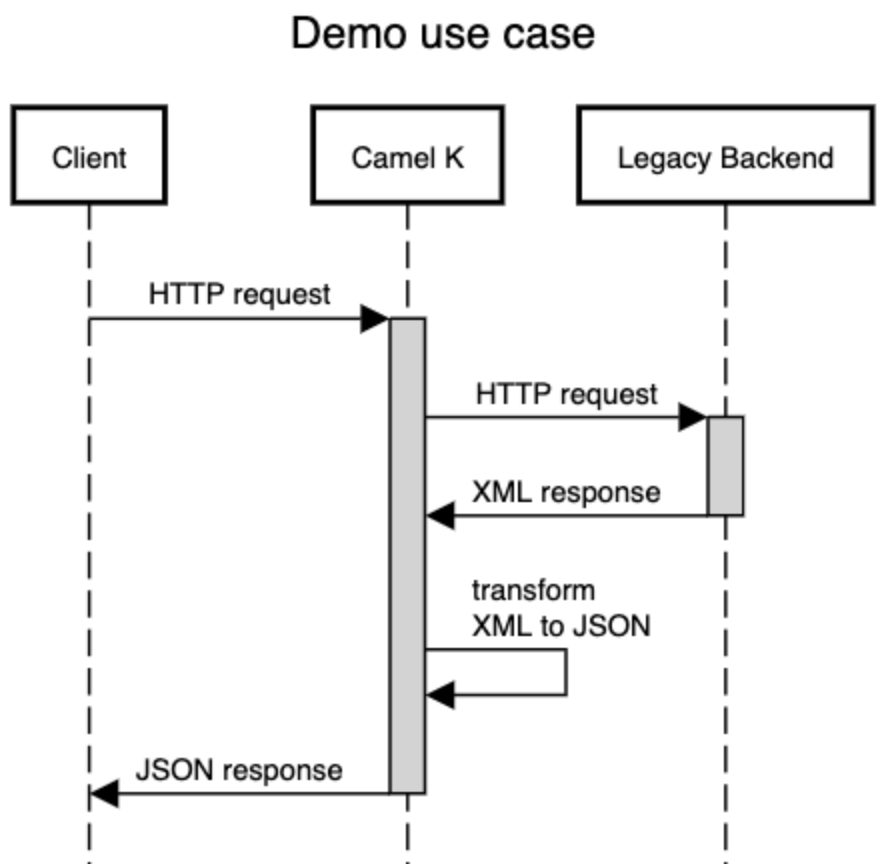
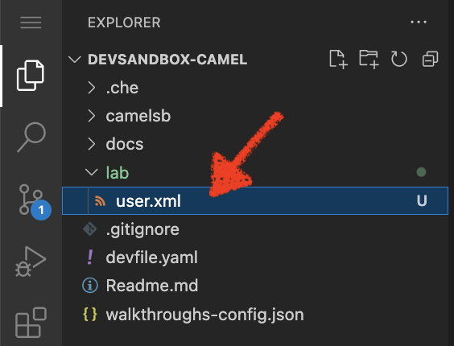
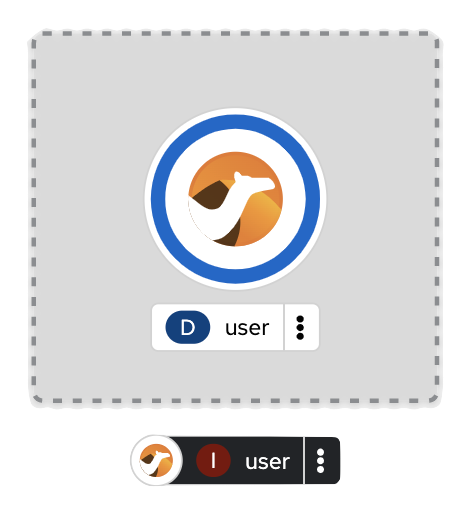
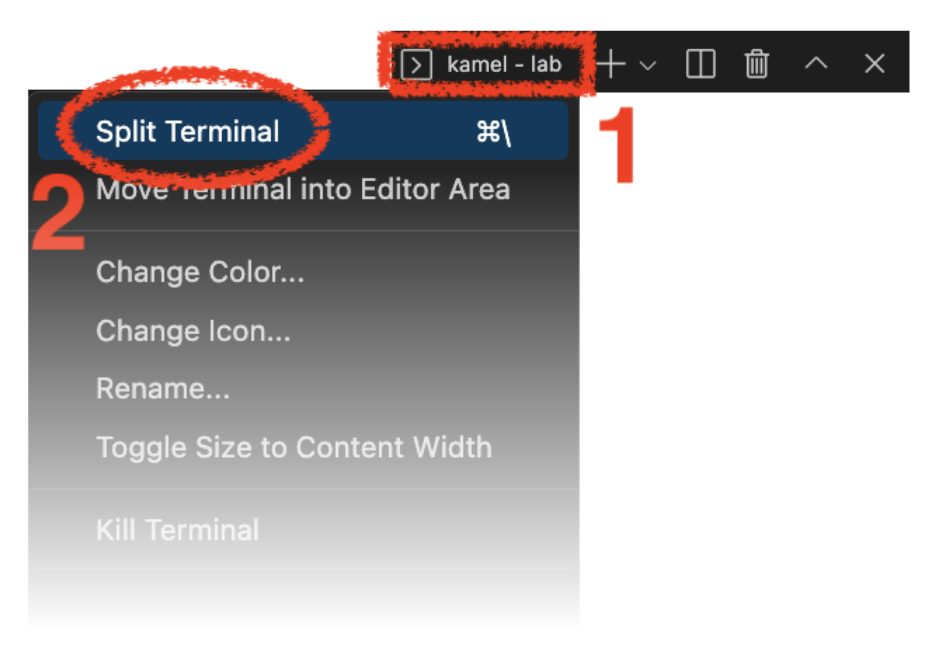
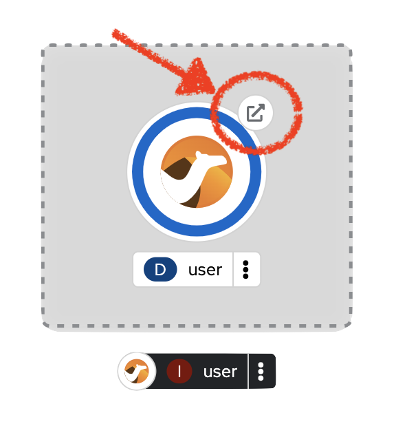
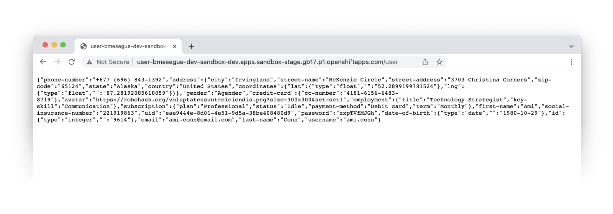

:walkthrough: Lab Introduction
:user-password: openshift
:namespace: {user-username}

:experimental:

:article-url: https://developers.redhat.com/articles/2023/03/09/try-camel-k-developer-sandbox
// URLs
:codeready-url: http://codeready-che.{openshift-app-host}/

ifdef::env-github[]
endif::[]

[id='lab-intro']
= Camel K - User Demo

Walk your first steps with Camel K by creating and running your first integration service that integrates with a legacy backend.

This hands-on lab is based on the following blog article in Red Hat Developers:

* link:{article-url}[window="_blank", , id="rhd-source-article"]

{empty} +

To recap what work is ahead, the sequence diagram below illustrates the flow you're about to create.




The Camel K integration will expose an HTTP entry point, and upon client requests, it'll fetch XML data from a (simulated) legacy backend, transform its response into JSON, and return it to the client application.

Assuming you have followed the article's instructions, you should be all set to get hands-on with _Camel K_ in the _OpenShift Dev Spaces_ workspace.

{empty} +


[time=2]
[id="preparations"]
== Lab Preparations

Before we start real work, let's prepare some equipment before riding the _Camel_.

{empty} +

. Toggle auto-save off
+
You'll be making live code changes which _Camel K_ can pick up in real time. You need to ensure the changes do not trigger a reload every time you press a key, but only when you manually save your changes.
+
image::images/autosave.png[align="left", width=30%]
+
WARNING: The auto-save option in the menu does not always show when it's active/inactive. If you see in your editor's file tab a permanent white dot `⭘` when you make changes, it means auto-save is OFF.
+
{empty} +

. Open your terminal
+
Make sure you make visible your terminal in the IDE. You can toggle it using the keyboard keys kbd:[Ctrl + `] or simply find the option from the menu system as per the picture below:
+
image::images/toggle-terminal.png[align="left", width=40%]

. Create a working folder
+
Execute the commands below to create a new directory from where you can work and is visible in your project explorer:
+
[source, subs=]
----
mkdir lab
cd lab
<br>
----
+
{empty} +

. Set your working project in _OpenShift_
+
Make sure your CLI `oc` client (_OpenShift_ client) points to your personal _Developer Sandbox_ project (aka namespace):
+
[source, subs=]
----
oc projects -q | xargs oc project<br>
----
+
NOTE: The _Developer Sandbox_ only allows 1 project (namespace) per user.
+
The command above should output something similar to:
+
----
Now using project "<your-username>-dev" on server "https://172.30.0.1:443".
----
+
{blank}
+
WARNING: Not specifying your target project (namespace) in _OpenShift_ may result in a deployment failure.
+
{empty} +


You're now all set and ready start riding the _Camel_.

{empty} +


[time=8]
[id="development"]
== Development Phase

This section guides you into creating your code and iterate over it using _Camel K's_ *'developer mode'*.

{empty} +

. Create your integration definition
+
To swiftly create a skeleton _Camel_ route definition, we can use the `kamel` client (_Camel K_ client) from the terminal. Execute the following command:
+
[source, subs=]
----
kamel init user.xml<br>
----
+
{blank}
+
The above command initialises an XML Camel definition. Camel also supports languages like Java, YAML, and others.
+
{empty} +

. Open it in your editor
+
You'll find your newly created integration file under the following path in your project explorer:
+
--
* `lab/user.xml`
+
{empty}
+

+
NOTE: The project tree also includes other _Camel_ resources from other lab tutorials, contained in the same source _GitHub_ project.
--
+
{blank}
+
Click on the _Camel_ source file to display it in your code editor.
+
The code you'll find in the file contains a default _Camel_ route written using the XML DSL (_Domain Specific Language_), but _Camel_ also provides a Java DSL and a YAML DSL.
+
{empty} +

. Make changes on the _Camel_ route
+
To make our new example a bit more interesting than the link:{article-url}[article's, window="_blank", , id="rhd-source-article"]  service called `roll-dice`, we will create an adaptation layer that will collect data in XML format from a remote server and will translate it to JSON. This is a very typical use case where modern API façades serve data collected from legacy systems.
+
Replace the default Camel route by the following one:
+
[source]
----
    <route id="xml">
        <from uri="timer:xml?repeatCount=1"/>

        <removeHeaders pattern="*"/>
        <to uri="https://random-data-api.com/api/v2/users?response_type=xml"/>

        <log message="${body}"/>
    </route>
----
+
{blank}
+
In the route above you'll see:
+
--
. The starting `timer` component configured to trigger only once (`repeatCount=1`)
. Then an outgoing HTTP(S) call is prepared to consume a remote free to use API that provides random data. In this example, the API returns random user data, and we specify it to be in XML format.
. The `log` statement to output the returned XML payload.
--
+
{empty} +
+
Press kbd:[Ctrl + s] (linux) or kbd:[⌘ + s] (mac) to save your changes.
+
{empty} +

. Run the integration
+
Run the _Camel_ route by executing the following command.
+
NOTE: _Camel K_ will build and deploy the process in the _Developer Sandbox_ for you.
+
[source, subs=]
----
kamel run user.xml --dev \
-d camel-jackson \
-d camel-jacksonxml<br>
----
+
{blank}
+
NOTE: The command includes the `--dev` flag to instruct the _Camel K_ client to run in *'developer mode'*. This mode hooks up your terminal with the running pod in _OpenShift_ and displays the pod's log outputs. It also enables fast iteration code updates where new edits on your code are immediately pushed to the environment in real-time allowing very fast coding cycles.
+
NOTE: You'll notice the command above includes two explicit dependencies. _Camel K_ analyses the code to resolve dependencies automatically, however, there is a pending ticket asking to include data formats (automatic translators in Camel). When the ticket will be resolved, the explicit dependencies will no longer be necessary.
+
When you run the command above, you should see in your terminal a long XML response containing random user data from the backend printed on the screen, and should contain fields similar to:
+
----
[1] 2023-01-10 18:24:41,778 INFO  [use.xml:17] (Camel (camel-1) thread #1 - timer://xml) <?xml version="1.0" encoding="UTF-8"?>
[1] <hash>
[1]   ...
[1]   <username>tyree.konopelski</username>
[1]   <email>tyree.konopelski@email.com</email>
[1]   ...
----
+
{blank}
+
If you have a look to your topology view from your _OpenShift_ developer console, you should see the integration running as a pod, as per the picture below:
+

+
{empty} +


. Iterate with live code changes 
+
Let's now enjoy the magic of _Camel K_ by modifying the code on the fly to pursue our goal, that is, to return the data in JSON format, and expose the service via HTTP.
+
1. Apply XML to JSON conversion
+
From the code below, take the snippet with the  (copy) button and inject it in your code in the same region as shown below, right after the outgoing HTTP invocation:
+
----
    <route id="xml">
        <from uri="timer:xml?repeatCount=1"/>

        <removeHeaders pattern="*"/>
        <to uri="https://random-data-api.com/api/v2/users?response_type=xml"/>
----
+
```xml
        <unmarshal>
            <jacksonXml/>
        </unmarshal>
        <marshal>
            <json/>
        </marshal>
```
+
----
        <log message="${body}"/>
    </route>
----
+
{blank}
+
NOTE: the marshal/unmarshal directive in _Camel_ converts data via the use of _Camel_ data formats. These are automatic data format converters. In the code above, the XML response is unmarshalled into a mid-step _Java_ structure, and then marshalled into the final JSON data.
+
Press kbd:[ctrl+s] (linux) or kbd:[⌘+s] (mac) to save your changes.
+
The _Camel K_ client, running in *'dev mode'*, catches the changes and pushes the new definition to _OpenShift_, causing the _Camel K_ operator to react and trigger a fast build/deploy replacing the previous version. From the developer's perspective, this happens transparently and very fast.
+
You will see in the terminal _Camel_ reloading the new definition and triggering a new HTTP request and this time displaying the result in JSON format, similar to:
+
----
{  … ,"email": "edith.green@email.com", …,"username": "edith.green"}
----
+
NOTE: The sample above is trimmed to just show some of the relevant fields. Your response will contain many other fields.
+
{empty} +
+
1. Expose the integration as an HTTP service
+
Since the payload is now transformed in the desired output format, we can perform one last edit to expose the service to be consumable via an HTTP entry point.
+
Replace the starting `timer` activity with the `platform-http` component. From the code below, take the snippet with the  (copy) button and replace the current `timer` activity in your code in the same region as shown below, right at the start the _Camel_ route:
+
----
    <route id="xml">
----
+
```xml
        <from uri="platform-http:/user"/> 
```
+
----
        <removeHeaders pattern="*"/>
        <to uri="https://random-data-api.com/api/v2/users?response_type=xml"/>
        <unmarshal>
            <jacksonXml/>
        </unmarshal>
        <marshal>
            <json/>
        </marshal>
        <log message="${body}"/>
    </route>
----
+
{blank}
+
The new `platform-http` activity above tells _Camel_ to use the native HTTP library to accept incoming invocations using the `/user` path.
+ 
Press kbd:[ctrl+s] (linux) or kbd:[⌘+s] (mac) to save your changes.
+
Once more, the platform's operator reacts and deploys a new version of the definition, except this time, we can invoke the service from a terminal to test it.
+
{empty} +
+
1. Test the service
+
Now, test the service from a new terminal. Choose the _Split_ option from the current terminal's top right corner, as shown below:
+

+
{blank}
+
From the new terminal, run the following cURL command to test your service:
+
[source, subs=]
----
curl http://user/user | jq<br>
----
+
NOTE: The command includes a pipe to parse the JSON response with JQuery, which nicely renders the returned JSON payload.
+
{blank}
+
You should see `curl` returning new randomly generated user data, in the expected JSON format.
+
{blank}
+
You should see in your IDE a view similar to the picture below showing both terminals, the logs from the _Camel K_ integration running in the _Developer Sandbox_, and the `curl` command output:
+
image::images/service-user-terminals.png[align="center", width=100%]

{empty} +

[type=verification]
Did you obtain the a JSON response similar to the one shown above?

[type=verificationSuccess]
You've successfully tested your Camel K HTTP service !!

[type=verificationFail]
Inspect the logs to investigate possible causes of failure.

{empty} +

Consider the development phase done. +
Press kbd:[ctrl+c] to stop your Camel K instance.

When stopped, you'll notice the pod in your _Developer Sandbox_ disappear:

image::images/pod-user-deleted.png[align="left", width=60%]

{empty} +

[type=verification]
Did you see your `user` pod deleted?

[type=verificationSuccess]
You're ready to step to the next chapter !!

[type=verificationFail]
You can try running `oc delete integration user` to force deleting the pod.


[time=4]
[id="deploy-integration"]
== Deploy your integration

Running the `kamel` client with the `--dev` flag (dev mode) showed you in the previous chapter how to hook your terminal with the running pod  (dev mode) in the _Developer Sandbox_. Now you will deploy your integration detached from your IDE.

. Execute the deployment command
+
All it takes to deploy your integration is to remove the `--dev` flag. +
Copy and paste the command below to push the integration to the _Developer Sandbox_:
+
[source, subs=]
----
kamel run user.xml \
-d camel-jackson \
-d camel-jacksonxml<br>
----
+
{blank}
+
What really happens behind the scenes when executing the command above is that the `kamel` client converts your source code into an _Integration_ CRD (Custom Resource Definition) defined in YAML and then pushes it to the _Developer Sandbox_.
+
It is the _Camel K_ operator, not visible to you, running in the _Developer Sandbox_, that picks up the CRD and triggers a build and deploys it.
+
{empty} +

. Visualise your pod
+
If you switch to your _Developer Sandbox_ topology view, you'll see the pod running again, only this time is not hooked to your terminal:
+

+
{empty} +

. Use the CLIs to confirm
+
You can use your terminal to obtain information about your running integration.
+
Using your `kamel` client, execute:
+
[source, subs=]
----
kamel get<br>
----
+
{blank}
+
Which should return something similar to:
+
----
NAME    PHASE   KIT
user    Running camel-k-operator/kit-ceu0v85mq41b5tocq4sg
----
+
{empty} +
+
Using your `oc` client (_OpenShift_ client), execute:
+
[source, subs=]
----
oc get integration<br>
----
+
{blank}
+
Which should return something similar to:
+
----
NAME   PHASE     KIT                        REPLICAS
user   Running   kit-ceu0v85mq41b5tocq4sg   1
----
+
{empty} +

. Test the service
+
Run the following cURL command to test your service:
+
[source, subs=]
----
curl http://user/user | jq<br>
----
+
NOTE: The command includes a pipe to parse the JSON response with JQuery, which nicely renders the returned JSON payload.
+
{blank}
+
You should see `curl` returning the expected JSON response, as in previous invocations.
+
{empty} +

. Invoke the service as an external client
+
Notice the previous cURL command uses an internal service URL, which is not directly accessible by external consumers. 
+
For security reasons, the _Camel K_ operator in the _Developer Sandbox_ does not expose the HTTP service by default. You need to manually create a route if you want external consumers to have access.
+
Run the following command to expose the service:
+
[source, subs=]
----
oc expose service user --path=/user<br>
----
+
{blank}
+
You can notice right away, from your topology view, your pod now showing a small icon to open the URL exposed by the service:
+

+
Click on it.
+
If your browser renders “Resource not found” or another error message, make sure your address bar uses HTTP (not HTTPS), and you include the service path ‘/user’ at the end of the URL, something similar to:
+
--
* `**http://**…(long address value here)...**/user**`
--
+
{blank}
+
In your browser, you should see user data in JSON format, similar to:
+

+
You can also obtain the route details with the following command and use its URL from your favourite local HTTP client/tester, like _Postman_, _Swagger_ or others.
+
[source, subs=]
----
oc get route user<br>
----
+
{blank}
+
Embedding the `oc get route` command in a cURL allows you to invoke the service as an external consumer.
+
--
* Copy/paste the following cURL command to simulate an external call and obtain a response from the _Camel_ service:
+
[source, subs=]
----
curl `oc get route user -o jsonpath={.spec.host}`/user | jq<br>
----
+
{blank}
+
The invocation should return the expected JSON payload.
+
--


{empty} +

[type=verification]
Did you see succeed to invoke the `user` service as an external consumer?

[type=verificationSuccess]
Well done !! make sure you follow the instructions below to clean your project.

[type=verificationFail]
Make sure your route is in place, and you force your browser to use HTTP with the `/user` path.

{empty} +

=== Clean up your project

When you're done playing in your _Developer Sandbox_, you can clean up your project (namespace) by un-deploying your _Camel K_ `user` integration by issuing the following command:

--
* {empty}
+
[source, subs=]
----
kamel delete user<br>
----
+
{blank}
+
or
+
* {empty}
+
[source, subs=]
----
oc delete integration user<br>
----
--

{empty} +

Make sure you also delete the route you created manually:

[source, subs=]
----
oc delete route user<br>
----

